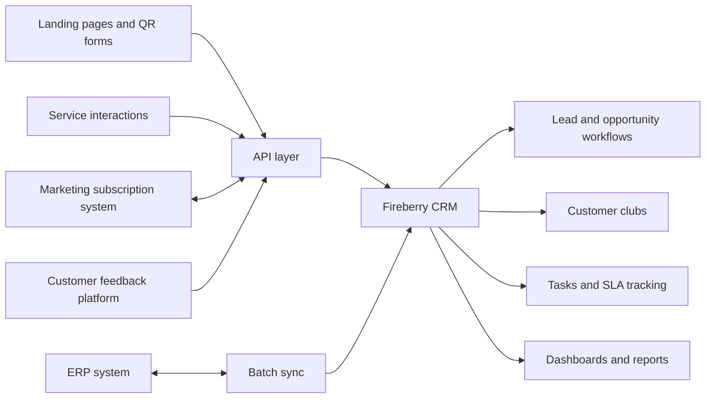

# Enterprise Retail CRM Solution Design

## Scope

Pre-sales discovery and solution architecture for an enterprise retail CRM rollout.

## Problem

An enterprise retail prospect needed a CRM architecture for managing leads, customer clubs, opportunities, service interactions, ERP data, customer feedback, dashboards, roles, permissions, and SLA-based sales workflows.

## Work Performed

Worked with leadership on a CRM solution design and implementation plan that mapped business requirements into Fireberry CRM objects, workflows, integrations, API endpoints, dashboards, and rollout milestones.

## Proposed Solution Areas

- Fireberry CRM for accounts, opportunities/leads, tasks, orders, dashboards, and role-based permissions.
- ERP integration through a custom API layer.
- Batch synchronization for ERP data where webhooks were unavailable.
- Lead intake from landing pages, web forms, QR codes, manual entry, cold lead uploads, and service channels.
- Duplicate detection using phone, email, and existing customer data.
- Warm and cold lead workflows with SLA stages.
- Customer club membership tracking.
- Customer service/ticket events feeding CRM opportunities.
- Marketing subscription and unsubscription handling.
- Future survey/feedback integration and sentiment reporting.
- Dashboards for headquarters, regional managers, sales managers, and sales agents.
- Implementation milestones covering ERD setup, UI setup, API skeleton, data loading, automation, training, go-live, ERP sync, dashboards, and handoff.

## Architecture Sketch

## Business Value

This case is useful for Solutions Engineer and Technical Consultant positioning because it shows pre-sales discovery, enterprise CRM architecture, integration planning, data modeling, workflow design, API specification, permissions planning, and implementation scoping.
