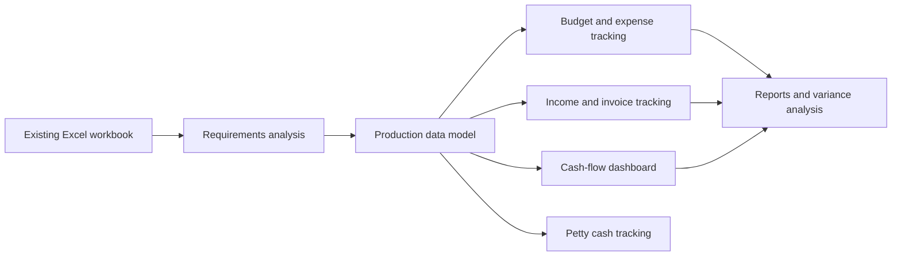

# Production Company Excel System Analysis

## Status

Confidential source artifact reviewed. Public case study should use anonymized company details and recreated/fake examples only.

## Problem

A production company was running core operational and financial workflows through Excel. The workbook had become a business operating system for production budgets, expenses, income, cash flow, VAT, petty cash, and reporting.

## Work Performed

Analyzed the existing Excel functionality and translated it into a structured requirements map for a more scalable production-management system.

## Capabilities Mapped

- Production dashboard with annual and monthly income/expense projections.
- Cash-flow tracking by production.
- Paid expenses and paid income before and after VAT.
- Future expected expenses and income.
- Estimated profit/loss.
- Pending income and expense invoices.
- Petty cash received, used, and remaining by production.
- Production creation fields: production name, status, episode count, minutes per episode, cost per episode, cost per minute, overhead, contingency, approved budget.
- Budget format mapping in Hebrew and English.
- Above-the-line and below-the-line budget structures.
- Budget comparison: planned vs. actual, used budget, remaining balance, budget variance.
- Expense tracking by category, production phase, and budget item.
- Income tracking from broadcasters or funding bodies.
- Invoice splitting across multiple productions and budget categories.
- Duplicate invoice detection requirements.
- Multi-currency and exchange-rate improvement opportunities.
- Reports for production status, income/expense, cash flow, petty cash, and budget deviations.

## Portfolio Value

This case is valuable because it shows discovery and systems analysis, not just automation. It demonstrates the ability to reverse-engineer a spreadsheet-based business process and convert it into a structured system blueprint.

## Recommended Public Artifact

Create a sanitized diagram showing:

## What To Add Later

- Fake table map for productions, budget lines, expenses, income invoices, petty cash, suppliers, and reports.
- Recreated dashboard screenshot using synthetic data.
- Before/after process diagram.
- Notes on whether this became Airtable, another system, or remained a requirements/design artifact.

