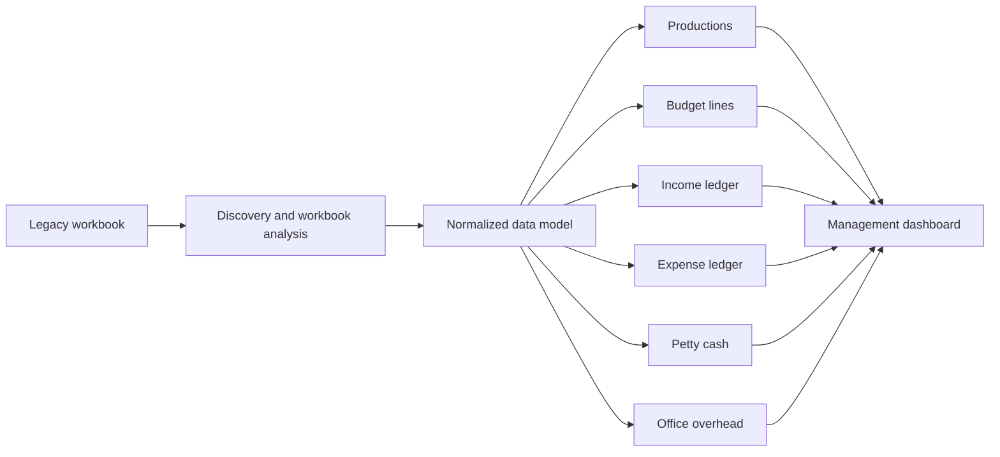

# Production Finance Operating System Analysis

## Status

Confidential source artifacts reviewed. Public materials use anonymized company details, synthetic examples, and reconstructed schema documentation only.

## Problem

A production company was running a large portion of its finance and operations process through a macro-enabled Excel workbook. The workbook had grown into a business operating system for production setup, budgets, expenses, income, cash flow, VAT handling, petty cash, office overhead, and management reporting.

The company needed a clearer path toward a scalable system that could preserve the business logic while making data easier to maintain, report on, and eventually migrate into a structured platform such as Airtable.

## Source Review

Reviewed a legacy `.xlsm` workbook and a supporting requirements document. The workbook included:

- 26 worksheets, including production-specific budget sheets, template sheets, dashboard sheets, income and expense ledgers, office overhead, and lookup/configuration tables.
- Macro/VBA content, workbook tables, chart objects, pivot artifacts, formulas, and data validations.
- A management dashboard summarizing budget, actual expenses, actual income, future income, future expenses, cash-flow position, final profit, and petty cash balance.
- Income and expense ledgers connected back to productions, budget categories, invoice data, payment status, payment dates, VAT status, and payment methods.
- Production budget templates for local and international productions with above-the-line and below-the-line budget structures.

The raw workbook contains real production names, financial data, and operational details and is intentionally excluded from this repository.

## Work Performed

- Reverse-engineered the workbook into a normalized business data model.
- Mapped spreadsheet formulas into system behaviors, rollups, reporting views, and automation candidates.
- Identified the main entities required for a public-safe Airtable-style implementation.
- Separated reusable system concepts from client-specific workbook details.
- Documented the migration path from spreadsheet logic to structured operational software.

## Capabilities Mapped

- Production creation and metadata: production type, status, episode count, minutes per episode, overhead, contingency, approved budget, and expected profit.
- Budget templates with above-the-line and below-the-line sections.
- Budget line items with categories, roles, cost codes, phase-based estimates, actual usage, and remaining balance.
- Expense tracking by production, budget item, invoice, supplier, payment method, payment date, VAT treatment, and payment status.
- Income tracking by production, payer/funding source, milestone, invoice reference, VAT status, expected payment date, and received status.
- Cash-flow tracking by month, production, paid amounts, future unpaid expenses, future unreceived income, and projected balance.
- Petty cash received, spent, and remaining by production.
- Office overhead budget, actual usage, and monthly profit/loss.
- Multi-currency and exchange-rate improvement opportunities for international productions.
- Duplicate invoice detection requirements by supplier, invoice number, amount, production, and date.
- Management reporting for production budget health, cash flow, open invoices, VAT exposure, and budget variance.

## Reconstructed Architecture

## Example Data Model

See [reconstructed-production-system-data-model.md](../docs/reconstructed-production-system-data-model.md) for the public-safe table map and reporting model.

## Portfolio Value

This case is valuable because it shows systems analysis, solution architecture, and migration thinking. The useful story is not "I edited a spreadsheet." It is:

> I reverse-engineered a real production finance workbook and translated it into a structured operating-system design with normalized data, reporting views, and migration-ready workflows.

## What To Add Later

- Synthetic Airtable screenshots based on the reconstructed schema.
- A recreated dashboard with fake production data.
- A before/after process diagram.
- Notes confirming which parts were implemented in Airtable and which remained design or requirements artifacts.
