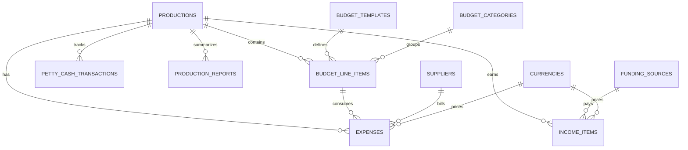

# Reconstructed Production System Data Model

This document reconstructs the core operating model behind a legacy production finance workbook. It focuses on the system design: entities, relationships, reporting views, and automation opportunities.

The goal is to show how a spreadsheet-based operating process can be translated into a maintainable business system for production budgeting, bookkeeping, cash-flow tracking, petty cash, and management reporting.

## System Scope

The reviewed workbook covered these operating areas:

- Production setup and metadata.
- Budget templates for local and international productions.
- Above-the-line and below-the-line budget planning.
- Expense and invoice tracking.
- Income and funding milestone tracking.
- VAT calculations and payment status.
- Petty cash received, spent, and remaining.
- Office overhead budget tracking.
- Cash-flow and management dashboards.
- Lookup/configuration tables for currencies, production types, templates, VAT rules, payment terms, and payment methods.

## Entity Relationship Map

## Tables

| Table | Purpose | Key fields |
| --- | --- | --- |
| Productions | Main record for each production or internal project. | Name, status, production type, start date, end date, episode count, minutes per episode, approved budget, overhead %, contingency %, expected profit. |
| Budget Templates | Reusable structures for different production formats. | Template name, production type, local/international flag, broadcaster format, default categories, default cost codes. |
| Budget Categories | Groups budget lines into management sections. | Category name, section, display order, above/below line flag, default VAT treatment. |
| Budget Line Items | Planned cost lines for a production. | Production, template, category, role, budget code, description, phase, unit type, quantity, unit price, planned amount, actual used, remaining balance. |
| Expenses | Expense and supplier invoice ledger. | Production, budget line, supplier, invoice number, invoice name, description, invoice date, payment terms, payment method, payment date, payment status, VAT status, amount before VAT, VAT amount, total paid. |
| Income Items | Income, broadcaster payments, client payments, and funding milestones. | Production, payer, milestone, invoice reference, expected payment date, status, VAT status, amount before VAT, VAT amount, total received. |
| Petty Cash Transactions | Cash received and cash usage by production. | Production, transaction type, date, recipient, description, related budget line, amount, receipt status. |
| Suppliers | Vendor and payee master data. | Supplier name, category, tax/VAT status, default payment terms, contact details, notes. |
| Funding Sources | Broadcasters, clients, and financing bodies. | Name, payer type, default VAT status, payment terms, contact details, notes. |
| Office Overhead | Internal office budget and actuals. | Month, budget category, planned amount, actual expenses, income, profit/loss. |
| Currencies | Currency and exchange-rate configuration. | Currency code, symbol, exchange rate, rate date, locked rate flag. |
| System Configuration | Shared operational settings. | VAT rules, payment methods, payment terms, status lists, production types, dashboard year. |
| Production Reports | Saved reporting snapshots or dashboard outputs. | Production, report period, budget total, actual expenses, received income, expected income, expected expenses, cash-flow balance, petty cash balance, variance notes. |

## Reporting Views

| View | Business question answered |
| --- | --- |
| Management Dashboard | What is the current budget, cash-flow, income, expense, and profit position across productions? |
| Production Budget Health | Which productions are over budget, under budget, or approaching planned limits? |
| Open Expenses | Which unpaid supplier invoices are due soon or overdue? |
| Expected Income | Which future payments are expected by month and payer? |
| Cash-Flow Forecast | What is the projected balance after future expenses and expected income? |
| Petty Cash Balance | How much petty cash was received, spent, and remains per production? |
| Office Profit/Loss | How are office overhead, internal income, and monthly profit/loss trending? |
| VAT Review | What VAT is expected, paid, exempt, or configured manually? |
| Duplicate Invoice Review | Which invoices may be duplicates based on supplier, invoice number, date, production, and amount? |

## Automation Candidates

- Create production records from a structured intake form.
- Apply a selected budget template to generate default budget lines.
- Recalculate planned, actual, and remaining budget totals when expenses are added.
- Flag budget lines when actual usage approaches or exceeds planned budget.
- Detect possible duplicate invoices before approval.
- Split one invoice across multiple productions or budget lines.
- Update cash-flow forecasts when income or expense statuses change.
- Recalculate petty cash balance when cash is received or used.
- Lock exchange rates per payment date for international productions.
- Send management alerts for overdue income, overdue expenses, and high-risk budget variance.

## Migration Notes

The workbook should not be migrated cell-by-cell. A better migration strategy is:

1. Identify the workbook's business entities and normalize them into tables.
2. Preserve formulas as rollups, calculated fields, dashboard views, and automations.
3. Import only clean historical records needed for reporting continuity.
4. Rebuild dashboards using synthetic public examples first, then real data privately.
5. Add validation rules before broad user rollout to prevent the same errors spreadsheets allow.

## Portfolio Summary

This project demonstrates the ability to inspect a complex, real-world workbook, understand the operational logic behind it, and convert that logic into a modern business system blueprint.
